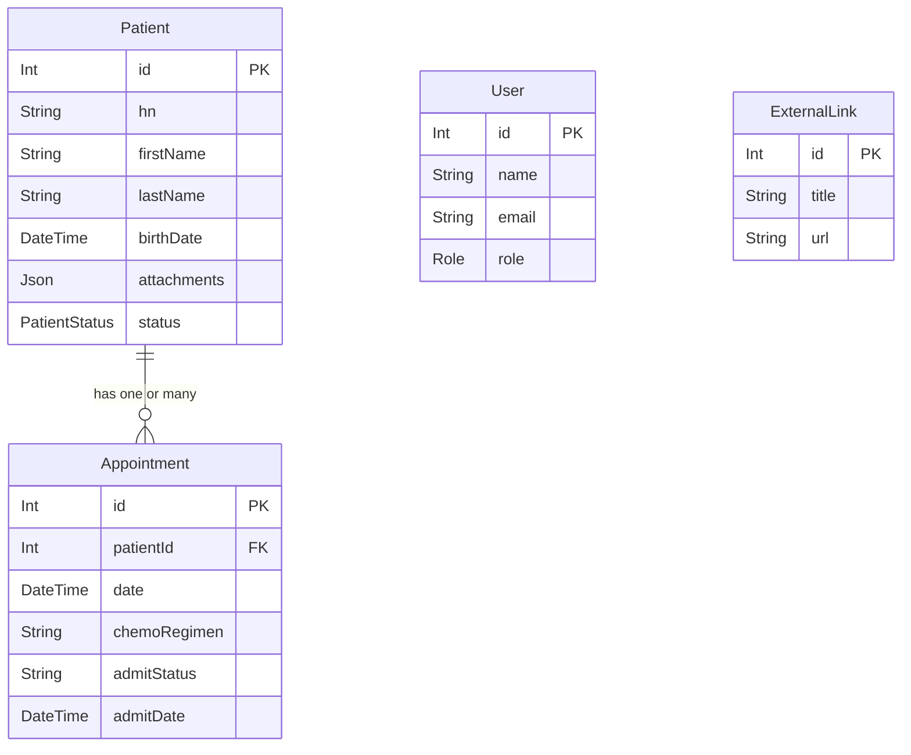

# ระบบจัดการข้อมูลผู้ป่วยและแดชบอร์ดหอผู้ป่วยเคมีบำบัด

ระบบจัดการข้อมูลผู้ป่วยและแดชบอร์ดสำหรับหอผู้ป่วยเคมีบำบัดที่พัฒนาด้วย React, Node.js, และ Prisma

**GitHub Repository:** [https://github.com/prhdev222/chemotherapy_ward_V1.2.git](https://github.com/prhdev222/chemotherapy_ward_V1.2.git)

## 🚀 คุณสมบัติหลัก

### 🔐 ระบบ Authentication
- ระบบล็อกอินด้วย JWT Token
- การจัดการสิทธิ์ตาม Role (Admin, Doctor, Nurse)
- การป้องกันการเข้าถึงหน้าต่างๆ ตามสิทธิ์

### 👥 การจัดการผู้ป่วย
- เพิ่ม/แก้ไข/ลบข้อมูลผู้ป่วย
- ข้อมูลพื้นฐาน: HN, ชื่อ, วันเกิด, ที่อยู่, สถานะ
- คำนวณอายุอัตโนมัติ
- การแสดงสถานะผู้ป่วย (Active, Inactive, Deceased)

### 📅 การจัดการนัดหมาย
- สร้าง/แก้ไข/ลบนัดหมาย
- เชื่อมโยงนัดหมายกับผู้ป่วย
- ระบบ Check-in/Discharge
- การเลื่อนนัดหมาย

### 🏥 แดชบอร์ดหอผู้ป่วยเคมีบำบัด
- **กล่องรอ Admit**: แสดงผู้ป่วยที่รอเข้ารับการรักษา
  - ปุ่ม Check-in
  - แจ้งไม่มาตามนัด
  - เลื่อนนัดหมาย
- **กล่องกำลัง Admit**: แสดงผู้ป่วยที่กำลังรักษาตัวอยู่
  - ปุ่ม Discharge
- **กล่องเครื่องมือ**: สำหรับฟังก์ชันค้นหาและ Export PDF (เตรียมไว้)
- **กล่อง Links**: แสดงลิงก์ภายนอกจากฐานข้อมูล

### 📋 การจัดการแผนการรักษา
- เพิ่ม/แก้ไขข้อมูลการวินิจฉัย
- จัดการแผนการรักษา
- เชื่อมโยงกับผู้ป่วย

### 🔗 การจัดการลิงก์ภายนอก
- เพิ่ม/แก้ไข/ลบลิงก์เอกสารภายนอก
- แสดงลิงก์ในแดชบอร์ด

## 🛠️ เทคโนโลยีที่ใช้

### Frontend
- **React 18** - UI Framework
- **React Router** - การจัดการ Routing
- **Vite** - Build Tool
- **Tailwind CSS** - Styling
- **TH Sarabun New** - ฟอนต์ไทย

### Backend
- **Node.js** - Runtime Environment
- **Express.js** - Web Framework
- **Prisma** - ORM และ Database Migration
- **SQLite** - Database
- **JWT** - Authentication
- **bcrypt** - Password Hashing

## 📁 โครงสร้างโปรเจกต์

```
CHEMO_CURSOR/
├── backend/
│   ├── prisma/
│   │   ├── migrations/          # Database migrations
│   │   └── schema.prisma        # Database schema
│   ├── src/
│   │   ├── routes/              # API routes
│   │   ├── middlewares/         # Middleware functions
│   │   └── app.js              # Main server file
│   └── package.json
├── frontend/
│   ├── src/
│   │   ├── components/          # Reusable components
│   │   ├── pages/              # Page components
│   │   ├── context/            # React context
│   │   └── main.jsx           # App entry point
│   └── package.json
└── README.md
```

## 🚀 การติดตั้งและรันโปรเจกต์

### ข้อกำหนดเบื้องต้น
- Node.js (เวอร์ชัน 18 หรือใหม่กว่า)
- npm หรือ yarn

### ขั้นตอนการติดตั้ง

1. **Clone โปรเจกต์**
```bash
git clone https://github.com/prhdev222/chemotherapy_ward.git
cd chemotherapy_ward
```

2. **ติดตั้ง Dependencies Backend**
```bash
cd backend
npm install
```

3. **ตั้งค่าฐานข้อมูล**
```bash
npx prisma migrate dev
npx prisma generate
```

4. **รัน Backend Server**
```bash
npm run dev
```
Backend จะรันที่ `http://localhost:5000`

5. **ติดตั้ง Dependencies Frontend** (เปิด Terminal ใหม่)
```bash
cd frontend
npm install
```

6. **รัน Frontend**
```bash
npm run dev
```
Frontend จะรันที่ `http://localhost:5173`

## 🔧 การตั้งค่า Environment Variables

สร้างไฟล์ `.env` ในโฟลเดอร์ `backend/`:

```env
DATABASE_URL="file:./dev.db"
JWT_SECRET="your-secret-key-here"
PORT=5000
```

## 👤 ข้อมูลผู้ใช้เริ่มต้น

ระบบมาพร้อมกับผู้ใช้เริ่มต้นสำหรับทดสอบ:

- **Admin**: admin@example.com / password123
- **Doctor**: doctor@example.com / password123  
- **Nurse**: nurse@example.com / password123

## 📊 โครงสร้างฐานข้อมูล

### ตารางหลัก
- **User**: ข้อมูลผู้ใช้ระบบ
- **Patient**: ข้อมูลผู้ป่วย
- **Appointment**: ข้อมูลนัดหมาย
- **Treatment**: ข้อมูลแผนการรักษา
- **ExternalLink**: ลิงก์ภายนอก

### ความสัมพันธ์
- User สามารถมีหลาย Appointment
- Patient สามารถมีหลาย Appointment และ Treatment
- Appointment เชื่อมโยงกับ Patient และ User

## 🔐 ระบบสิทธิ์

- **Admin**: เข้าถึงทุกฟังก์ชัน
- **Doctor**: จัดการผู้ป่วย, นัดหมาย, แผนการรักษา
- **Nurse**: จัดการสถานะผู้ป่วย, Check-in/Discharge, เลื่อนนัดหมาย

## 🎨 UI/UX Features

- **Responsive Design**: รองรับทุกขนาดหน้าจอ
- **Sidebar Navigation**: เมนูด้านข้างที่ใช้งานง่าย
- **Modal Dialogs**: สำหรับเพิ่ม/แก้ไขข้อมูล
- **Real-time Updates**: อัปเดตข้อมูลแบบ Real-time
- **Thai Language Support**: รองรับภาษาไทยเต็มรูปแบบ

## 🚧 การพัฒนาต่อ

### ฟีเจอร์ที่วางแผนไว้
- [ ] ระบบ Export PDF
- [ ] ระบบค้นหาขั้นสูง
- [ ] ระบบแจ้งเตือน
- [ ] Dashboard Analytics
- [ ] ระบบ Backup ข้อมูล

### การปรับปรุงที่แนะนำ
- เพิ่ม Unit Tests
- เพิ่ม E2E Tests
- ปรับปรุง Error Handling
- เพิ่ม Logging System
- ปรับปรุง Performance

## 🤝 การมีส่วนร่วม

1. Fork โปรเจกต์
2. สร้าง Feature Branch (`git checkout -b feature/AmazingFeature`)
3. Commit การเปลี่ยนแปลง (`git commit -m 'Add some AmazingFeature'`)
4. Push ไปยัง Branch (`git push origin feature/AmazingFeature`)
5. เปิด Pull Request

## 📝 License

โปรเจกต์นี้อยู่ภายใต้ MIT License - ดูรายละเอียดในไฟล์ [LICENSE](LICENSE)

## 📞 ติดต่อ

หากมีคำถามหรือข้อเสนอแนะ กรุณาติดต่อ:
- GitHub Issues: [สร้าง Issue ใหม่](https://github.com/prhdev222/chemotherapy_ward/issues)

---

**หมายเหตุ**: โปรเจกต์นี้พัฒนาสำหรับการใช้งานในโรงพยาบาล กรุณาตรวจสอบและทดสอบอย่างละเอียดก่อนใช้งานจริง

# ระบบจัดการหอผู้ป่วยเคมีบำบัด (Chemo Ward Management System)

โปรเจกต์นี้คือระบบเว็บแอปพลิเคชันสำหรับจัดการข้อมูลในหอผู้ป่วยเคมีบำบัด พัฒนาขึ้นเพื่อช่วยให้บุคลากรทางการแพทย์ (แพทย์, พยาบาล, เจ้าหน้าที่) สามารถติดตามและจัดการข้อมูลผู้ป่วย, การนัดหมาย, และแผนการรักษาได้อย่างมีประสิทธิภาพ

## 1. SRS (Software Requirements Specification) - ข้อกำหนดความต้องการของซอฟต์แวร์

### 1.1. ภาพรวมและขอบเขต
- **บทคัดย่อ:** เว็บแอปพลิเคชันสำหรับบุคลากรทางการแพทย์เพื่อจัดการข้อมูลผู้ป่วย, การนัดหมาย, และแผนการรักษาในหอผู้ป่วยเคมีบำบัด
- **เป้าหมาย:** ลดขั้นตอนการทำงานที่ซ้ำซ้อน, รวมศูนย์ข้อมูล, และเพิ่มความสะดวกในการเข้าถึงข้อมูลของผู้ป่วย
- **ผู้ใช้งานเป้าหมาย:** แพทย์, พยาบาล, และเจ้าหน้าที่ธุรการในแผนก

### 1.2. Functional Requirements (ความต้องการเชิงฟังก์ชัน)
- **FR1: การจัดการผู้ใช้งาน (User Management)**
    - ผู้ใช้ต้องสามารถ Login เข้าสู่ระบบด้วย Email และ Password ได้
    - ระบบต้องมีการแบ่งบทบาทผู้ใช้ (Admin, Doctor, Nurse) เพื่อจำกัดสิทธิ์การเข้าถึงข้อมูลและการกระทำต่างๆ
- **FR2: การจัดการข้อมูลผู้ป่วย (Patient Management)**
    - ผู้ใช้ (ที่ได้รับสิทธิ์) ต้องสามารถ เพิ่ม/แก้ไข/ดู/ลบ ข้อมูลผู้ป่วยได้
    - ข้อมูลผู้ป่วยที่จัดเก็บได้แก่: HN, ชื่อ-นามสกุล, วันเกิด(หรืออายุ), ข้อมูลติดต่อ, ที่อยู่, การวินิจฉัย, และสถานะ (Active, Inactive, Deceased)
- **FR3: การจัดการการนัดหมาย (Appointment Management)**
    - ผู้ใช้ (ที่ได้รับสิทธิ์) ต้องสามารถ เพิ่ม/แก้ไข/ลบ การนัดหมายได้
    - การนัดหมายต้องเชื่อมโยงกับผู้ป่วยที่มีอยู่ในระบบ
    - สามารถกำหนดวันที่, เวลา, สูตรยาเคมีบำบัด (Chemo Regimen), และหมายเหตุได้
- **FR4: แดชบอร์ดหอผู้ป่วย (Chemo Ward Dashboard)**
    - ต้องมีแดชบอร์ดแสดงภาพรวมสำหรับหอผู้ป่วย
    - แสดงรายชื่อผู้ป่วยที่รอเข้ารับการรักษา (สถานะ Waiting)
    - แสดงรายชื่อผู้ป่วยที่กำลังรักษาตัว (สถานะ Admit)
    - สามารถทำการ **Check-in (Admit)**, **เลื่อนนัด**, หรือ **Discharge** ผู้ป่วยจากแดชบอร์ดได้
- **FR5: การจัดการแผนการรักษา (Treatment Plan Management)**
    - ในหน้าข้อมูลผู้ป่วย, ผู้ใช้สามารถอัปโหลดไฟล์ที่เกี่ยวข้องกับการรักษาได้ (เช่น Guideline, ผล Lab)
    - สามารถแนบไฟล์ได้หลายไฟล์ และสามารถตั้งชื่อและลบไฟล์ที่แนบได้
- **FR6: การส่งออกข้อมูล (Data Export)**
    - ผู้ใช้สามารถส่งออก (Export) รายชื่อผู้ป่วยและรายชื่อการนัดหมายในรูปแบบไฟล์ PDF และ Excel ได้

### 1.3. Non-functional Requirements (ความต้องการนอกเหนือฟังก์ชัน)
- **NFR1: ความปลอดภัย (Security):** การสื่อสารระหว่าง Frontend และ Backend ต้องมีการเข้ารหัส (HTTPS) และการยืนยันตัวตนต้องใช้ JSON Web Tokens (JWT)
- **NFR2: ประสิทธิภาพ (Performance):** แอปพลิเคชันต้องตอบสนองต่อผู้ใช้ได้อย่างรวดเร็ว การโหลดข้อมูลไม่ควรใช้เวลานานเกิน 3-5 วินาที
- **NFR3: การใช้งาน (Usability):** หน้าตาโปรแกรม (UI) ต้องสะอาด, เข้าใจง่าย, และใช้งานได้สะดวก แม้สำหรับผู้ที่ไม่คุ้นเคยกับเทคโนโลยี

---

## 2. ER Diagram (แผนภาพความสัมพันธ์ของข้อมูล)

แผนภาพนี้แสดงโครงสร้างและความสัมพันธ์ของตารางหลักในฐานข้อมูล



**คำอธิบายความสัมพันธ์:**
*   **Patient - Appointment (หนึ่ง-ต่อ-กลุ่ม):** ผู้ป่วย 1 คน สามารถมีการนัดหมายได้หลายครั้ง แต่การนัดหมาย 1 ครั้ง จะเป็นของผู้ป่วยแค่คนเดียวเท่านั้น
*   **User, ExternalLink:** เป็นตารางเดี่ยวที่ไม่มีความสัมพันธ์โดยตรงกับตารางอื่นในแง่ของ Foreign Key แต่ `User` มีไว้สำหรับควบคุมสิทธิ์การเข้าถึงข้อมูลทั้งหมดในระบบ

---

## 3. เทคโนโลยีที่ใช้ (Tech Stack)

-   **Frontend:** React.js, Vite, React Router, CSS
-   **Backend:** Node.js, Express.js, Prisma
-   **Database:** PostgreSQL

---

## 4. วิธีการติดตั้ง (Installation)

### 4.1. สิ่งที่ต้องมี (Prerequisites)
1.  **Node.js:** เวอร์ชัน 16+ [ดาวน์โหลดที่นี่](https://nodejs.org/en/download/)
2.  **PostgreSQL:** [ดาวน์โหลดและติดตั้งที่นี่](https://www.postgresql.org/download/)

### 4.2. ขั้นตอนการติดตั้ง
**1. Clone โปรเจกต์:**
```bash
git clone https://github.com/prhdev222/chemotherapy_ward_V1.1.git
cd chemotherapy_ward_V1.1
```
**2. ติดตั้ง Backend:**
```bash
cd backend
npm install
```
**3. ตั้งค่าฐานข้อมูล (Backend):**
   - สร้างไฟล์ `.env` ในโฟลเดอร์ `backend`
   - ใส่ข้อมูล `DATABASE_URL` และ `JWT_SECRET` ของคุณ (ดูตัวอย่างในไฟล์)
   - สร้างฐานข้อมูลใน PostgreSQL ให้ตรงกับชื่อที่ตั้งใน `DATABASE_URL`
   - รันคำสั่ง `npx prisma migrate dev --name init` เพื่อสร้างตาราง

**4. ติดตั้ง Frontend:**
```bash
cd ../frontend
npm install
```

### 4.3. การรันโปรเจกต์ (Running the Application)
- **Terminal 1 (Backend):**
  ```bash
  cd backend
  npm start
  ```
- **Terminal 2 (Frontend):**
  ```bash
  cd frontend
  npm run dev
  ```
- เข้าใช้งานผ่าน `http://localhost:5173`

---

## 5. คู่มือการดูแลรักษาและแก้ไขโค้ด (Maintenance & Code Guide)

### 5.1. โครงสร้างโปรเจกต์ที่สำคัญ
```
CHEMO_CURSOR/
├── backend/
│   ├── prisma/
│   │   └── schema.prisma   # <-- **สำคัญ:** โมเดลของฐานข้อมูลทั้งหมด
│   └── src/
│       ├── routes/         # <-- **สำคัญ:** กำหนดเส้นทางของ API แต่ละเรื่อง
│       └── app.js          # ไฟล์หลักของ Express server
│
└── frontend/
    └── src/
        ├── components/     # <-- คอมโพเนนท์ที่ใช้ซ้ำได้ (Layout, Modal)
        ├── context/        # <-- AuthContext จัดการข้อมูล user ที่ login
        └── pages/          # <-- **สำคัญ:** โค้ดของแต่ละหน้าในระบบ
```

### 5.2. กระแสการทำงานของข้อมูล (Data Flow)
ระบบทำงานโดยมีกระแสข้อมูลพื้นฐานดังนี้:
**Frontend (React) -> เรียก API -> Backend (Express) -> ติดต่อฐานข้อมูล (Prisma)**

1.  **ผู้ใช้กระทำบนหน้าเว็บ (UI):** เช่น กดปุ่ม "บันทึก" ในหน้า `frontend/src/pages/PatientManagement.jsx`
2.  **เรียกใช้ฟังก์ชัน:** ฟังก์ชัน (เช่น `handleSavePatient`) จะถูกเรียก และใช้ `fetch` API เพื่อส่ง Request ไปยัง Backend
3.  **Proxy ของ Vite:** ใน `frontend/vite.config.js` มีการตั้งค่า proxy `'/api'` ให้วิ่งไปที่ `http://localhost:3001` โดยอัตโนมัติ
4.  **Backend รับ Request:** ที่ `backend/src/app.js`, Express จะดูว่า URL ที่เรียกมาตรงกับ `routes` ไหน (เช่น `/api/patients`)
5.  **Middleware ตรวจสอบสิทธิ์:** ที่ `backend/src/middlewares/auth.js` จะมีการตรวจสอบ Token (JWT) ก่อนว่าผู้ใช้มีสิทธิ์ทำสิ่งนั้นหรือไม่
6.  **Controller ประมวลผล:** โค้ดในไฟล์ route (เช่น `backend/src/routes/patient.js`) จะทำงาน โดยใช้ `Prisma Client` เพื่อสั่งให้ฐานข้อมูลทำงาน (เช่น `prisma.patient.create()`)
7.  **Backend ส่งผลลัพธ์กลับ:** Backend ส่งข้อมูลกลับมาในรูปแบบ JSON
8.  **Frontend อัปเดตหน้าจอ:** Frontend ได้รับข้อมูลกลับมา แล้วใช้ `setPatients()` เพื่ออัปเดต State ทำให้หน้าเว็บแสดงผลข้อมูลใหม่ล่าสุด

### 5.3. การแก้ไขและเพิ่มเติมระบบ

**ตัวอย่าง: หากต้องการเพิ่มช่อง "กรุ๊ปเลือด (bloodGroup)" ให้กับผู้ป่วย**

1.  **Backend (แก้ไขฐานข้อมูล):**
    -   ไปที่ `backend/prisma/schema.prisma`
    -   ใน `model Patient` เพิ่มบรรทัด `bloodGroup String?`
    -   เปิด Terminal ในโฟลเดอร์ `backend` แล้วรัน `npx prisma migrate dev --name add-bloodgroup-to-patient` เพื่ออัปเดตฐานข้อมูลจริง

2.  **Backend (แก้ไข API):**
    -   ไปที่ `backend/src/routes/patient.js`
    -   ตรวจสอบให้แน่ใจว่าใน logic ของ `create` และ `update` มีการรับ `bloodGroup` จาก `req.body` เพื่อบันทึกลงฐานข้อมูล

3.  **Frontend (แก้ไขหน้าจอ):**
    -   ไปที่ `frontend/src/pages/PatientManagement.jsx`
    -   ในคอมโพเนนท์ `PatientForm` เพิ่ม `<input>` สำหรับ "กรุ๊ปเลือด"
    -   เพิ่ม `bloodGroup` เข้าไปใน `useState` ของฟอร์ม (`formData`)
    -   ตรวจสอบว่าฟังก์ชัน `handleSavePatient` ได้ส่งข้อมูล `bloodGroup` ไปกับ `body` ของ `fetch` ด้วย
    -   (ไม่บังคับ) เพิ่มการแสดงผล "กรุ๊ปเลือด" ในตารางรายชื่อผู้ป่วย

การแก้ไขส่วนอื่นๆ ก็จะใช้หลักการเดียวกันนี้ คือ **แก้ไขจากหลังมาหน้า (DB -> API -> UI)** ซึ่งเป็นวิธีที่ทำให้เห็นภาพรวมและผิดพลาดได้ยากที่สุด